# portfolio completion

## projects

- [x] Stonks
- [x] NSG
- [x] WordBlitz Solver
- [x] Windows Forms voxel engine
- [ ] NDI
- [ ] Exotic DB
- [ ] STLK
- [ ] Exotic escobar
- [ ] Lowatem AlphaZero
- [ ] CTJS modules
- [ ] Nike scrapping bot
- [x] Stairs.io
- [x] Exotic Café

## other

- [ ] Special thanks

# TEMPLATE

```md
# Project Name

`STATUS`

> quick desc

[images]

text

**date**

List of the skills involved / practiced / learnt
```

# Stonks /w Refactor

`DISCONTINUED`

> Hypixel skyblock AH flipping bot


This was my main project for almost 2 years, it is a sniping tool for the game Hypixel Skyblock, it's a bot which scans the ingame market 24/7 and notifies you when an item has been put up for sale for too low, which you can then easely buy with the keybinds of the `ingame mod` or from the `discord bot` feed. I started the project alone and in mid 2021, I met Refactor, a friend who helped me with the project and taught me `c++` aswell as `flask`. This project taught me almost everything I know about low level programming, optimisation, algorithms and networks.

**2020 - 2021 - 2022**

_Python, Javascript, Golang, C++, Rust, Java, Kotlin_

# NSG /w Refactor

`WIP`

> NFT sniping bot

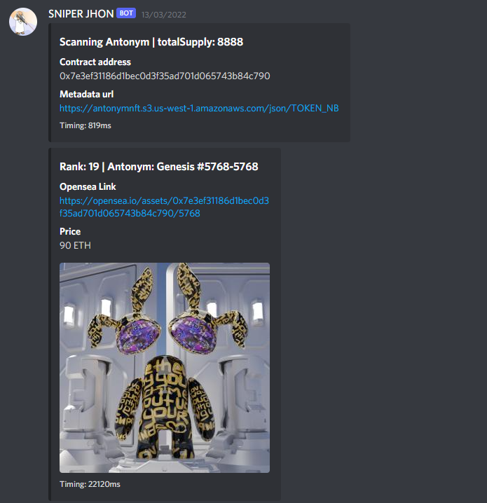

NSG is a discord me and some friends which I made along my NFT/WEB3 journey created. In this discord I made a bot which notifies us when nft collections reveal and tells us which nfts are the cheapest on opensea, to then buy and resell for massive profits. I learned rust along the way. Refactor helped me with some performance issues and brainstorming here. I learned a lot more optimisation along the way.

**2022 february - ?**

_Rust_

# WordBlitz Solver

`DONE`

> WordBlitz self playing bot

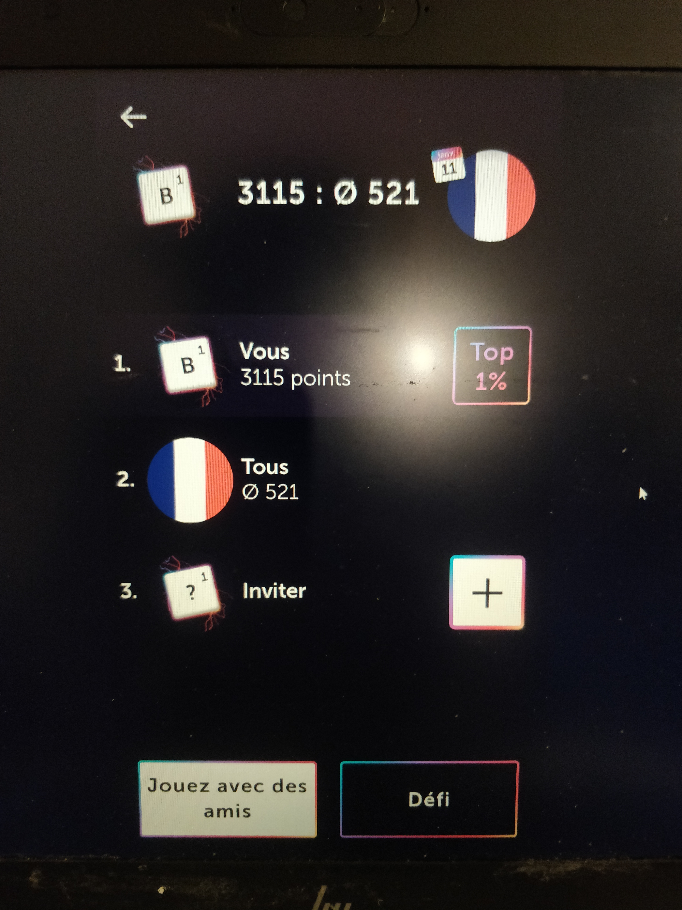

When I saw my parents play a little scrabble like mobile game, I had the idea of making a bot which plays the game by itself using the scrabble dictionnary (which i had to store in a specific made data structure for lookup performance). Using tesseract to get the board letters into python and using DFS to find the possible words. PYautoGUI was also used to fake mouse inputs and let python play the game on an Android emulator (NOX). This project taught me python oop, aswell as OCR and pyautogui + it was the early introduction to data structures and algorithmic optimisation for me.

**2021 january**

_python, tesseract_

# Voxel Game engine

`WIP`

> A simple 3d voxel game engine made in WindowsForms .NET

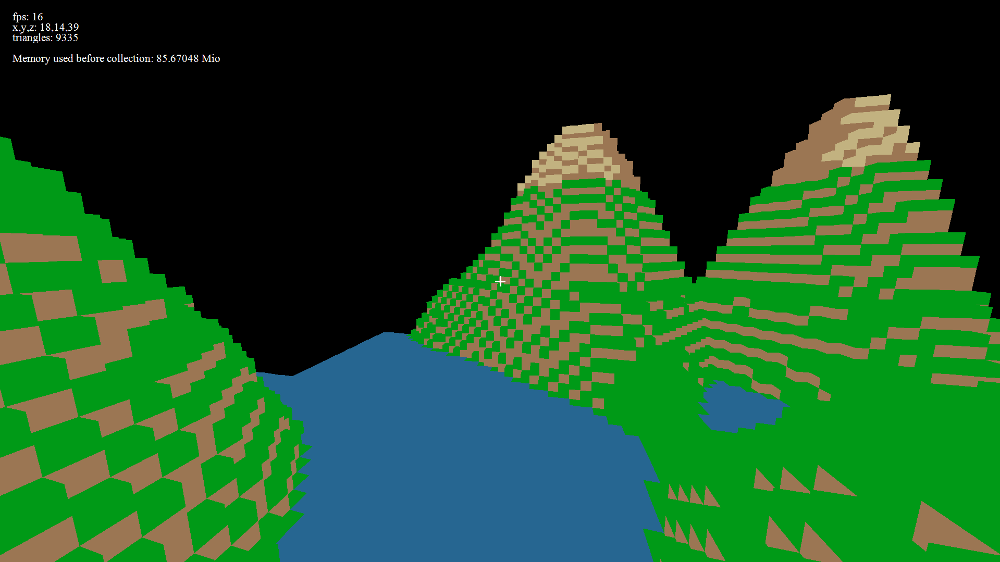

In class we were taught how to draw lines, points and circles in a windows forms .NET application. I had the idea of making a game loop using the Invalidate() method, which allowed me to then make a rendering engine using matrix maths. This turned into a mincraft clone. This project mostly made me more comfortable about using matrices and Trigonometry.

**2022 march - ?**

_.NET, c#, windows forms_

# NDI /w Team Git Poule

`DONE`

> VueJs Website made during a national all nighter coding challenge

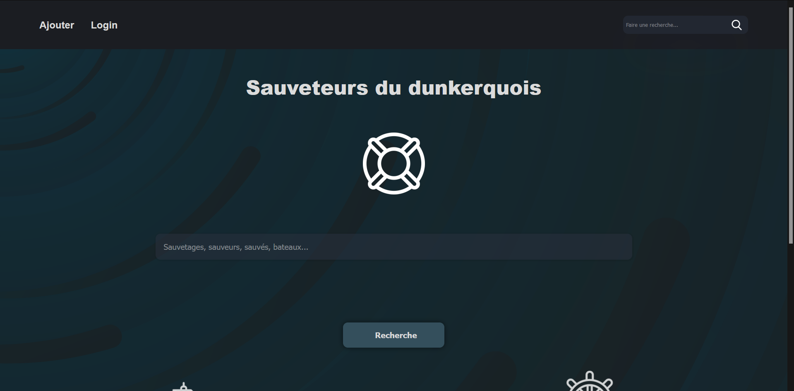

I participated to the french NDI (nuit de l'info) / Computer science night, we had to make a new website for Breton lifeguards. There were optinnal challenges we could take part in as a team in addition to the main challenge of the night (making the site). We chose to go all in for the dark mode challenge. We made the frontend in VueJs, Backend in PHP and used mySQL as the database for the site. We had to fill in our new site with some of their original site's data, and instead of doing it by hand, I used python to scrap the old website's data and fill up our database.

**2021 december**

_vuejs, php, python, html, css_

# Exotic Database

`DONE`

> The first Hypixel Skyblock public exotic armor database

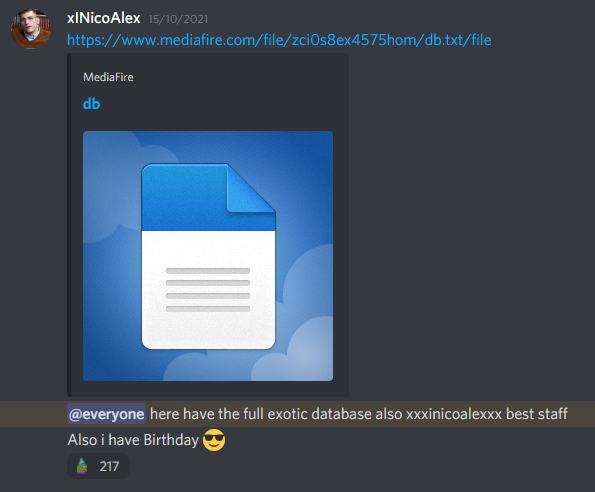

Using data from the Hypixel Public API (REST), I used BFS to traverse player friendlists and build up a list of Player uuids, which I then scanned with python to build up a mongo database, to store all of the found exotic armor pieces in the game which were scattered trough millions of player inventories. This Database was then released the 10 000 members of the Exotic Café discord, with a guide to search items inside of it. Through this project I learned to use python requests aswell as the json format for REST apis and pymongo wrapper.

**2020 | Special thx to Leaphant and RyanHCode**

_python, mongodb_

# STLK

`DISCONTINUED`

> STLK is a website used to track players in the game Hypixel Skyblock, it aims to help players to trade goods, even with different timezones

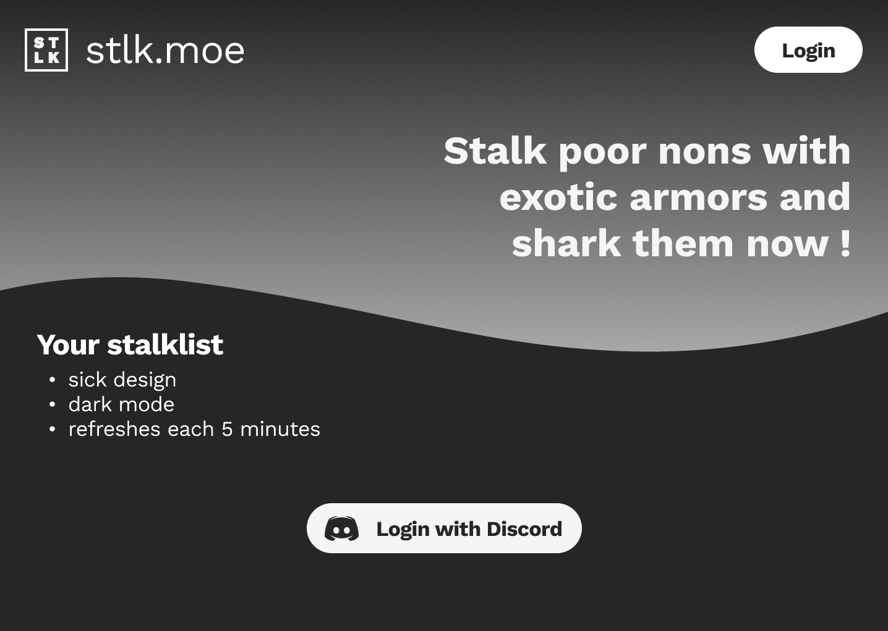
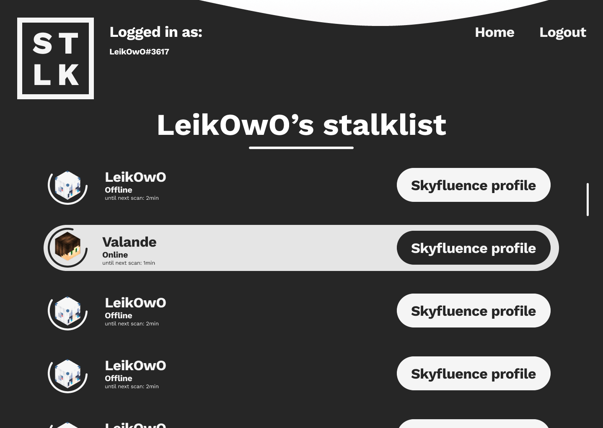

After creating the Exotic Database, I knew which players had the rare exotic armor pieces I was searching for, but knowing wasn't enough to buy those pieces from them. I needed a way to contact them, and being french, I had a different timezone as most of the players. I ended up creating a first version of a tracker in python, which worked but wasn't easy to use and could only be ran in local. That's why I decided to create STLK. It was a good project to learn figma prototyping on and VueJs aswell. I ended up making several iterations of the design in figma. When I was satisfied with the prototypes and design of the overall page, it was sadly the end of my vacations and with class I didn't have as much time to spend on learning Vue and ended up giving up on the project. I learned a lot through this.

**2021**

_vuejs, html, css, figma_

# Exotic twitter bot

`DONE`

> A twitter bot which notifies you on your phone when an Exotic Armor piece was put up for sale in the ingame auction house of Hypixel Skyblock

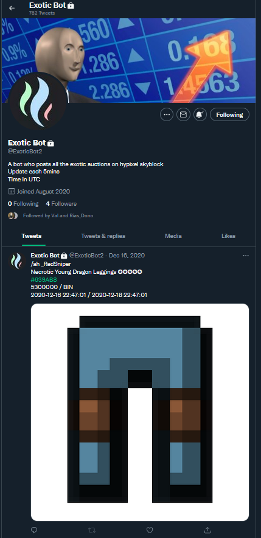

At the beginning of the exotic armor hunt era, players didn't have any ways of tracking the rare armor pieces, some where put up for sale on the ingame auction house amongst the normal pieces. I had the idea of making a twitter bot which we would follow to get notifications and be able to get the pieces off the auction house quickly after they were put up for sale. I learned to work with twitter bot api in python aswell as python requests and the json format here too.

**2020**

_python, twitter api_

# Lowatem AlphaZero

`DISCONTINUED`

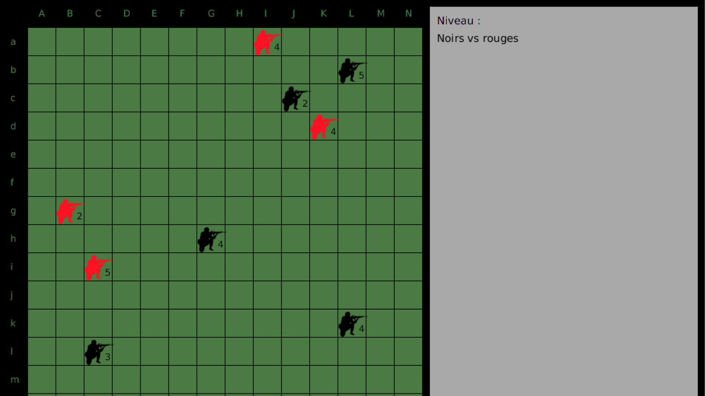

//TODO

**2021**

_Java_

# CTJS modules (js)

`DONE`

//TODO

**2020 - 2021**

_javascript_

# Nike scrapping bot (py)

`DONE`

> A bot which notifies you through twitter when your favorite sneakers are for sale

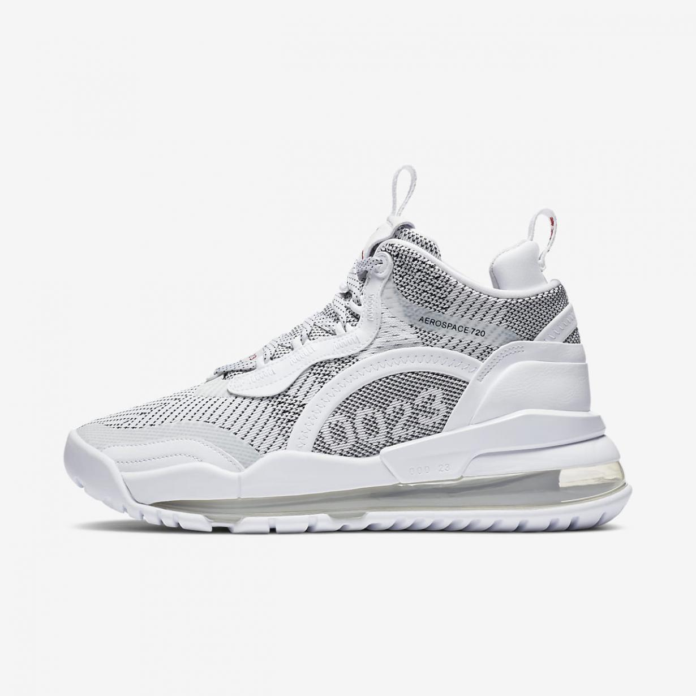

When I missed the occasion to buy a pair of sneakers I wanted, I decided to make a bot that would send me a notification on my phone when this exact pair would come back for sale on nike's official website. I reused my twitter bot code from the Exotic twitter bot, and learned how to scrap a website using beautiful soup, and with some python code I made a working twitter bot to notify me when my favorite sneakers pair would come back for sale (spoiler, I wear them everyday).

**2020**

_python, beatifulsoup4, twitter api_

# Stairs.io

`DONE`

> A simple flappy bird like mobile game


Stairs.io is my first mobile game, I created it for education purposes and learned c# while making it aswell as Unity.

**2020**

_unity, c#_

# Exotic Café

`WIP`

> A discord for Hypixel Skyblock exotic armor collectors

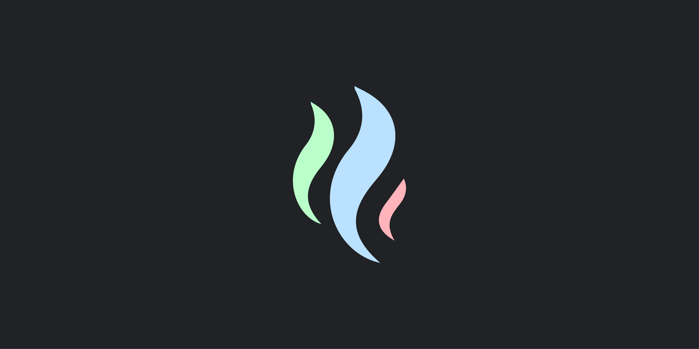

Exotic Café is the discord community I created for the game Hypixel Skyblock, it's a community for collectors of some special ingame items. I learned community moderation and management aswell as adobe illustrator while making the different logos. The discord was created with my coop Vincent and two other friends (Rias_dono and Axore). I'm extremely grateful for the amazing moderation team and the admins <3.

**2020-2022**

_adobe illustrator, communication_

# People who helped me on my journey to become a developper (they all agreed to have their names here)

TODO: ? means i need to ask for permission to put their name here

- ?Leaphant
- RyanHCode
- Illum1ii
- Meyi
- Refactor
