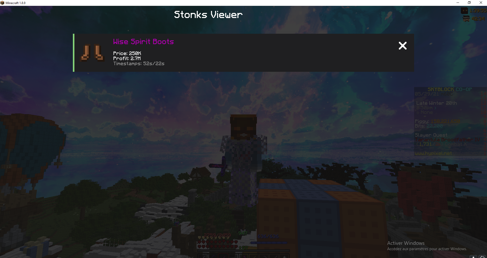
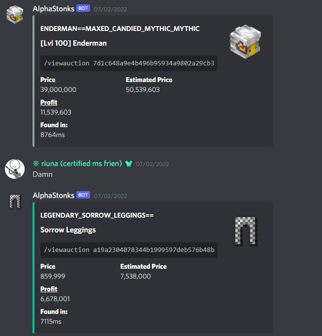
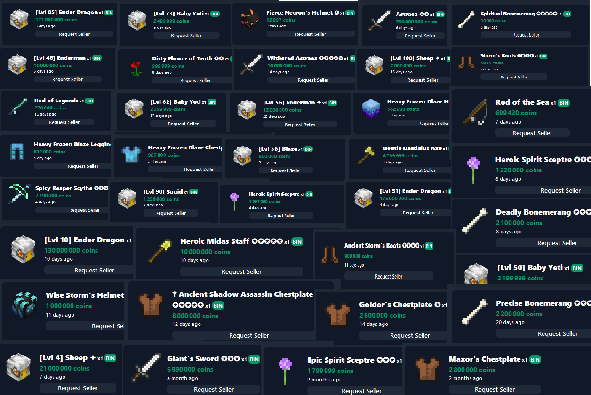

# portfolio completion

## projects

- [x] Stonks
- [x] NSG
- [x] WordBlitz Solver
- [x] Windows Forms voxel engine
- [ ] NDI
- [ ] Exotic DB
- [ ] STLK
- [ ] Exotic escobar
- [ ] Lowatem AlphaZero
- [ ] CTJS modules
- [ ] Nike scrapping bot
- [x] Stairs.io
- [x] Exotic Café

## other

- [ ] Special thanks

# Stonks (py, js, go, cpp, rust, Java, Kotlin) /w Refactor

`DISCONTINUED`

This was my main project for almost 2 years, it is a sniping tool for the game Hypixel Skyblock, it's a bot which scans the ingame market 24/7 and notifies you when an item has been put up for sale for too low, which you can then easely buy with the keybinds of the `ingame mod` or from the `discord bot` feed. I started the project alone and in mid 2021, I met Refactor, a friend who helped me with the project and taught me `c++` aswell as `flask`. This project taught me almost everything I know about low level programming, optimisation, algorithms and networks.

**2020 - 2021 - 2022**

# NSG (rust) /w Refactor

`WIP`

NSG is a discord me and some friends which I made along my NFT/WEB3 journey created. In this discord I made a bot which notifies us when nft collections reveal and tells us which nfts are the cheapest on opensea, to then buy and resell for massive profits. I learned rust along the way. Refactor helped me with some performance issues and brainstorming here. I learned a lot more optimisation along the way.

**2022 february - ?**

# WordBlitz Solver (python, tesseract OCR)

`DONE`

When I saw my parents play a little scrabble like mobile game, I had the idea of making a bot which plays the game by itself using the scrabble dictionnary (which i had to store in a specific made data structure for lookup performance). Using tesseract to get the board letters into python and using DFS to find the possible words. PYautoGUI was also used to fake mouse inputs and let python play the game on an Android emulator (NOX). This project taught me python oop, aswell as OCR and pyautogui + it was the early introduction to data structures and algorithmic optimisation for me.

**2021 january**

# 3d Voxel Game engine WinForms (c# .NET)

`WIP`

In class we were taught how to draw lines, points and circles in a windows forms .NET application. I had the idea of making a game loop using the Invalidate() method, which allowed me to then make a rendering engine using matrix maths. This turned into a mincraft clone. This project mostly made me more comfortable about using matrices and Trigonometry.

**2022 march - ?**

# NDI (nodejs, vue, py, mySQL, php, html, css) Team Git Poule /w IUT Bordeaux + Enseirb Matmeca

`DONE`

//TODO

**2021 december**

# Exotic DB (py, mongo) Special thx to Leaphant and RyanHCode

`DONE`

//TODO

**2020**

# STLK (nodejs, vue, html, css, figma)

`DISCONTINUED`

//TODO

**2021**

# Exotic escobar (twitter api, py)

`DONE`

//TODO

**2020**

# Lowatem AlphaZero (Java)

`DISCONTINUED`

//TODO

**2021**

# CTJS modules (js)

`DONE`

//TODO

**2020 - 2021**

# Nike scrapping bot (py)

`DONE`

//TODO

**2020**

# Stairs.io (c#, Unity)

`DONE`

Stairs.io is my first mobile game, I created it for education purposes and learned c# while making it aswell as Unity.

**2020**

# Exotic Café https://discord.gg/dye (Adobe Illustrator)

`WIP`

Exotic Café is the discord community I created for the game Hypixel Skyblock, it's a community for collectors of some special ingame items. I learned community moderation and management aswell as adobe illustrator while making the different logos. The discord was created with my coop Vincent and two other friends (Rias_dono and Axore). I'm extremely grateful for the amazing moderation team and the admins <3.

**2020-2022**

# People who helped me on my journey to become a developper (they all agreed to have their names here)

TODO: ? means i need to ask for permission to put their name here

- ?Leaphant
- ?RyanHCode
- ?Illum1ii
- Meyi
- ?Refactor
